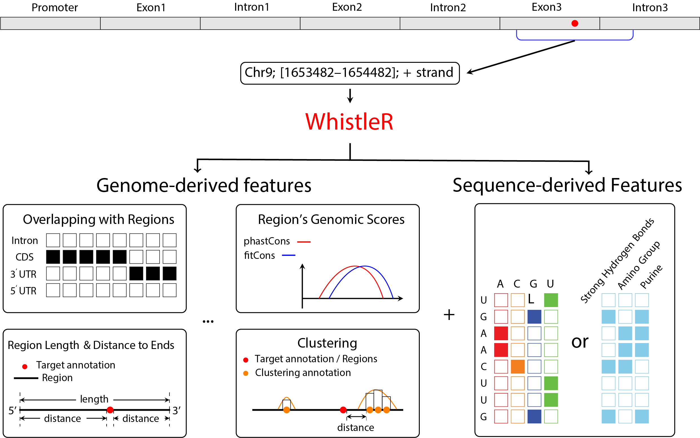

WhistleR: extract genomic features for predictive modeling in genomics
================
2021-01-30

# Introduction

This guide will offer an overview on a work flow of Bioconductor package
WhistleR to annotate comprehensive genome-derived features on the
range-based genomic objects. The package can be used to extract
properties of region lengths, sequence contents, relative positions,
clustering effects, and conservation scores on top of the commonly used
transcript annotations including 5’UTR, CDS, 3’UTR, transcripts, genes,
and promoters. The genome-derived features can be used to predict
variety of RNA and gene related genomic assays, such as the RBP binding
sites and the RNA modification peaks or sites. WhistleR also provide the
annotation of new attributes over user-defined genomic regions, enabling
the augmentation of feature engineering under the interactive framework
between properties and regions.

The package currently implements 2 types of feature extraction modules:
the **genome-derived features** and the **sequence-derived
features**.The former features are obtained through the interaction
between genomic properties and the genomic regions, and the later
includes the one-hot encoded nucleotide sequences or the encoding
through pseudo nucleotide compositions (PseTNC). The genome-derived
features can be annotated with the function “*genomeDerivedFeatures*”,
and the sequence features can be annotated using the function
“*sequenceDerivedFeatures*”. In addition, more genome-derived features
can be defined using functions with names “`extractRegion`” + the metric
names. While the specific functions can generate the genomic properties
over the user defined region types.

The design of package enables the one-step extraction of hundreds of
genomic features based only on the *GRanges* of the target genome
intervals. Wide class of the Bioconductor annotation objects, including
*Txdb*, *EnsDb*, *BSgenome*, and *GScores*, are supported in the package
to enable the massive enumeration of features that based on novel
sources of genomic regions.

While the comprehensive feature input is vital to the success of a
genomic data science project, the genome-derived features are often more
informative and interpretive than the primary sequence features. Thus,
the *WhistleR* package can provide reliable support to both the machine
learning modeling and the predictive factor identification on the
genomic response variable.

This user’s guide will first give an overview to the key functionalities
of the package, then illustrate the utility of the predictive features
using a case study of the full workflow of a genomic prediction task,
from EDA to ML modeling.

## Overview of functionalities

*WhistleR* provides fast and comprehensive feature extraction from the
range-based genome annotation; the extracted features can be used as the
input for a variety of modeling purposes such as supervised predictive
modeling and unsupervised factor analysis. The target range-based
annotation should be stored in *GRanges* object, which can be created
using the constructor function defined in the *GenomicFeatures* package.
Alternatively, the *GRanges* can be imported from the external
annotation files in **BED**, **GFF**, or **GTF** formats using the
`import` function defined in *dplyr* package.

There are 2 types of genomic features implemented in *WhistleR*: the
region properties features, and the sequence-derived features. The
former is extracted using an interactive design between the genomic
properties and the genomic regions, the latter is the sequence-derived
features extracted from the sequences of the flanking regions of the
annotation. When extracting the sequence-derived features, different
encoding methods can be specified, such as the one-hot method or the
pseudo nucleotide composition method.

<div class="figure" style="text-align: left">



<p class="caption">

Feature extraction framework of WhistleR

</p>

</div>

## Download

*WhistleR* can be installed from both bioconductor and github.

To install *WhistleR* from bioconductor, start R (version \>“3.6”) and
enter:

``` r
if(!requireNamespace("BiocManager", quietly = TRUE))
    install.packages("BiocManager")
BiocManager::install("WhistleR")
```

For order versions of R, please refer to the appropriate [Bioconductor
release](https://www.bioconductor.org/about/release-announcements/).

Installation from github can be initiated with the following command:

``` r
devtools::install_github("zw-xjtlu/WhistleR")
```

## Detailed User's Guide

For getting specific information about the usage of WhistleR, type the following command after loading the package to view the instruction file:

``` r
WhistleR::WhistlerUsersGuide()
```

